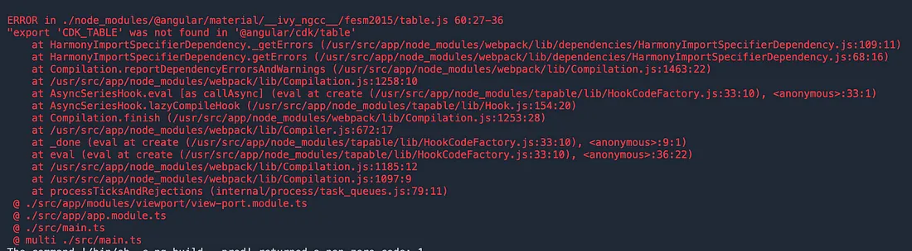

I was containerizing the front-end of an application that was build in `Angular 9` with `Bootstrap` and `Angular Material UI`. It was working on my developers' local terminals. However, when I containerized it, several warnings and this error occurs.



## What I Did?
Of course, I Googled my way into it. Tried the following according to the blogs:
- Cleared the `node_modules/`
- Add or save the plugin
- Deleted the `package-lock.json`
- Clear the cache

Any possible solution that worked on other developers, but did' not work on me. Sad life.

## Wait, I noticed something
After reading a blog again, one caught my attention and noticed the writer just executed the following:

1. `npm install @angular/core`
2. `npm install @angular/common`
3. `npm install @angular/`

However, when I opened the `package.json`, these are already installed.

## So, what now?
I tried to rearrange the lines of dependency

**Before**
```
 "private": true,
  "dependencies": {
    "@angular/animations": "~9.0.5",
    "@angular/cdk": "^9.2.1",
    "@angular/compiler": "~9.0.5",
    "@angular/forms": "~9.0.5",
    "@angular/material": "^9.1.1",
    "@angular/platform-browser": "~9.0.5",
    "@angular/platform-browser-dynamic": "~9.0.5",
    "@angular/router": "~9.0.5",
    "@angular/core": "~9.0.5",
    "@angular/common": "~9.0.5",
    "angular-material": "^1.1.21",
    "angular-ng-autocomplete": "latest",
    "bootstrap": "^4.4.1",
    "lodash": "^4.17.15",
    "rxjs": "~6.5.4",
    "sweetalert2": "^9.7.0",
    "tslib": "^1.11.1",
    "zone.js": "~0.10.2"
```

**After**
```
"private": true,
  "dependencies": {
    "@angular/animations": "~9.0.5",
    "@angular/core": "~9.0.5",
    "@angular/common": "~9.0.5",
    "@angular/cdk": "^9.2.1",
    "@angular/compiler": "~9.0.5",
    "@angular/forms": "~9.0.5",
    "@angular/material": "^9.1.1",
    "@angular/platform-browser": "~9.0.5",
    "@angular/platform-browser-dynamic": "~9.0.5",
    "@angular/router": "~9.0.5",
    "angular-material": "^1.1.21",
    "angular-ng-autocomplete": "latest",
    "bootstrap": "^4.4.1",
    "lodash": "^4.17.15",
    "rxjs": "~6.5.4",
    "sweetalert2": "^9.7.0",
    "tslib": "^1.11.1",
    "zone.js": "~0.10.2"
```

Noticed the arrangement of these?
- `"@angular/core": "~9.0.5"`
- `"@angular/common": "~9.0.5"`
- `"@angular/cdk": "^9.2.1"`

For some reason the when `@angular/cdk` was added it was inserted at the top. Seems like all new plugins that were saved were at the top. But during `npm install` that's not the case for me.

## The Result
1. Most of the warnings were gone
2. The `CDK_Table` issue was gone

## Support
If this helped you in a way. Support by buying me a coffee.

<script async
  src="https://js.stripe.com/v3/buy-button.js">
</script>

<stripe-buy-button
  buy-button-id="buy_btn_1PAWpKEYu0pSAPSug5UqKdxU"
  publishable-key="pk_live_51NQ80nEYu0pSAPSupNEqzuXzhbshyKG4LiReIRin4NfdoiTVki55JMiUNkEFPMR1ZOGa0z7lmnjk546awmC6MpzA00v7ztnctD"
>
</stripe-buy-button>