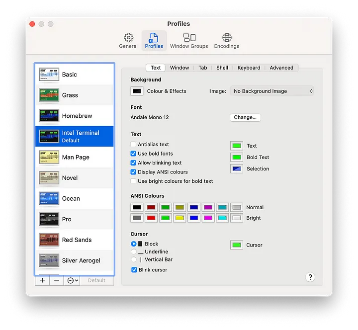
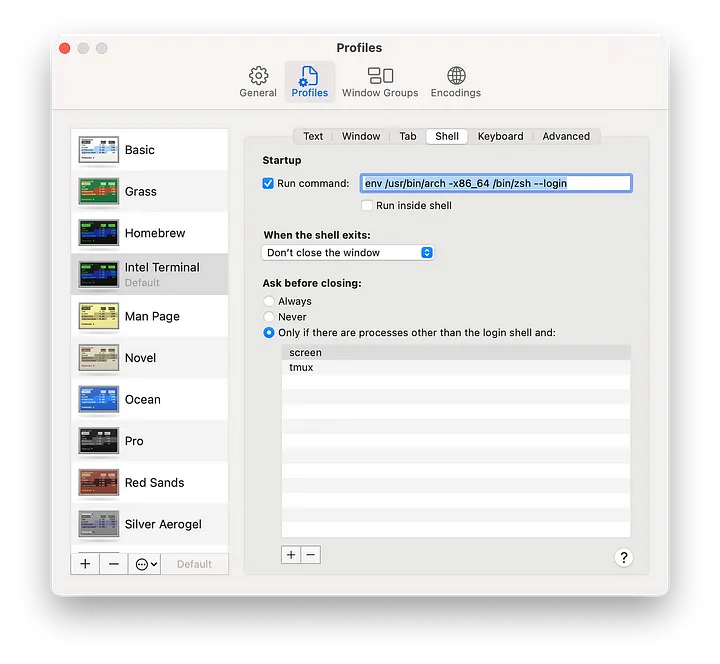

In this blog, I write down on how I solved the out-of-the-box problem of Pentaho with M1 chips of MacOS.

## The Problem I Had with M1 Chip macOS

After trying to install the "out-of-the-box" app and getting the Java8, I ended up with this error:

```shell
herman@hmenorjr ~/Downloads/data-integration $ ./spoon.sh java.lang.UnsatisfiedLinkError: Could not load SWT library. Reasons: 
no swt-cocoa-4940r23 in java.library.path: [./../libswt/osx64/] no swt-cocoa in java.library.path: [./../libswt/osx64/] Can\'t load library: 
/Users/herman/.swt/lib/macosx/aarch64/libswt-cocoa-4940r23.jnilib Can\'t load library: /Users/herman/.swt/lib/macosx/aarch64/libswt-cocoa.jnilib 
Can\'t load library: /Users/herman/.swt/lib/macosx/aarch64/libswt-cocoa-4940r23.jnilib at org.eclipse.swt.internal.Library.loadLibrary(Library.java:338) 
at org.eclipse.swt.internal.Library.loadLibrary(Library.java:257) at org.eclipse.swt.internal.C.<clinit>(C.java:19) 
at org.eclipse.swt.widgets.Display.<clinit>(Display.java:107) at org.pentaho.di.ui.core.widget.OsHelper.setAppName(OsHelper.java:106) 
at org.pentaho.di.ui.spoon.Spoon.main(Spoon.java:652) at java.base/jdk.internal.reflect.NativeMethodAccessorImpl.invoke0(Native Method) 
at java.base/jdk.internal.reflect.NativeMethodAccessorImpl.invoke(NativeMethodAccessorImpl.java:62) 
at java.base/jdk.internal.reflect.DelegatingMethodAccessorImpl.invoke(DelegatingMethodAccessorImpl.java:43) 
at java.base/java.lang.reflect.Method.invoke(Method.java:566) 
at org.pentaho.commons.launcher.Launcher.main(Launcher.java:92) 
herman@hmenorjr ~/Downloads/data-integration $ java --version 
openjdk 11.0.19 2023-04-18 
OpenJDK Runtime Environment Homebrew (build 11.0.19+0) 
OpenJDK 64-Bit Server VM Homebrew (build 11.0.19+0, mixed mode)
```

## What I Did

### Pentaho App
Download and config the app.

1. Download the tool: https://sourceforge.net/projects/pentaho/files/Pentaho-9.2/client-tools/pdi-ce-9.2.0.0-290.zip/download
2. Unzip it (of course) in `/Applications/ and you should see a folder data-integration/`
3. Execute this command: `/data-integration/libswt/osx64/and delete swt.jar`
4. Download this file and put it where the swt.jar were deleted: 2.06 MB file on MEGA (Do not rename it)

### Java
Now the app is set, time for the JDK.

1. Download and install Java 8 compatible with M1 [HERE](https://adoptium.net/releases.html?variant=openjdk8)   
2. Configure your terminal, I'm currently `~/.zshrc`. so I'm updating that by opening the file in terminal and adding this in it: `export JAVA_HOME=/Library/Java/JavaVirtualMachines/temurin-8.jdk/Contents/Home`

### Terminal
Config macOS' console/terminal/command prompt or whatever you call it.

1. Open the terminal's setting. 
2. Copy any profiles you want. Mine, I copied Homebrew and renamed it "Intel Terminal" 
3. Go to "Shell" tab and put this in the "Run Command" field: `env /usr/bin/arch -x86_64 /bin/zsh --login`
4. Uncheck "Run inside shell"
5. Restart the terminal

Profile 1:


Profile 2:


To start Pentaho, execute this command in the terminal:
`cd /Applications/data-integration/`

Then execute: `./spoon.sh`

And that should do it!

## Support
Thank you for being a valued reader of my blog! Your support means the world to me and helps me continue to create valuable content for you. Here are a few ways you can show your support:

- **Share the Love:** If you enjoy the articles, consider sharing them with your friends, family and social media followers. Sharing the content helps to reach a wider audience and grow a community that simply shares solving problems.
- **Feedback is Appreciated:** I value your feedback! Let me know what you think about the content, what topics you'd like to see more of and any suggestions you have for improving my blog. Your input helps me tailor the content to better serve you.
- **Buy a Coffee:** If you'd like to support financially, consider buying me a coffee. Your donation goes a long way in helping to cover the costs associated with running and maintaining the blog. Even a small contribution can make a big difference!

<script async
  src="https://js.stripe.com/v3/buy-button.js">
</script>

<stripe-buy-button
  buy-button-id="buy_btn_1PAWpKEYu0pSAPSug5UqKdxU"
  publishable-key="pk_live_51NQ80nEYu0pSAPSupNEqzuXzhbshyKG4LiReIRin4NfdoiTVki55JMiUNkEFPMR1ZOGa0z7lmnjk546awmC6MpzA00v7ztnctD"
>
</stripe-buy-button>