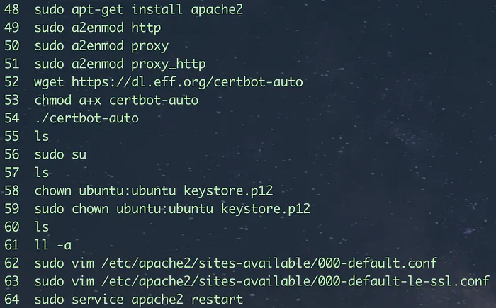

## TL;DR
I was trying to update the SSL certificate on our AWS/EC2 instance but the sudo certbot renew was throwing an error. After trying so many options on Google and nothing worked. Finally decided to just re-install the certificate by following instructions in https://certbot.eff.org/lets-encrypt/ubuntuxenial-apache

## The Story
Tried running the `sudo certbot` renew command as instructed on the https://certbot.eff.org website, I got the following error:

```./certbot-auto has insecure permissions!
To learn how to fix them, visit https://community.letsencrypt.org/t/certbot-auto-deployment-best-practices/91979/
Creating virtual environment…
Traceback (most recent call last):
File “/usr/lib/python3/dist-packages/virtualenv.py”, line 2363, in <module>
main()
File “/usr/lib/python3/dist-packages/virtualenv.py”, line 719, in main
symlink=options.symlink)
File “/usr/lib/python3/dist-packages/virtualenv.py”, line 988, in create_environment
download=download,
File “/usr/lib/python3/dist-packages/virtualenv.py”, line 918, in install_wheel
callsubprocess(cmd, showstdout=False, extra_env=env, stdin=SCRIPT)
File “/usr/lib/python3/dist-packages/virtualenv.py”, line 812, in call_subprocess
% (cmd_desc, proc.returncode))
OSError: Command /opt/eff.org/certbot/venv/bin/python2.7 — setuptools pkg_resources pip wheel failed with error code 1
Traceback (most recent call last):
File “<stdin>”, line 27, in <module>
File “<stdin>”, line 19, in create_venv
File “/usr/lib/python2.7/subprocess.py”, line 541, in check_call
raise CalledProcessError(retcode, cmd)
subprocess.CalledProcessError: Command ‘[‘virtualenv’, ‘ — no-site-packages’, ‘ — python’, ‘/usr/bin/python2.7’, ‘/opt/eff.org/certbot/venv’]’ returned non-zero exit status 1
```

Googled the following `letsencrypt certbot` and appending the error:
```
Creating virtual environment…
Traceback (most recent call last):
File
```

Tried all the possible solutions I could try by uninstalling the python, python3 and virtualenv. Nothing worked.

## Root Cause Analysis
Since I was not the one who set up the SSL certificate, I had to look into the history commands to see on how the previous developer set up the SSL. Found the following lines of commands:



Then tried looking into YouTube by passing the search criteria “letsencrypt certbot” and found something similar process which seems that it was installed on an old process of certbot.

## The End Game
Out of frustration, I just did the following as instructed on the certbot website

### Installation:
```
$ sudo apt-get update
$ sudo apt-get install software-properties-common
$ sudo add-apt-repository universe
$ sudo add-apt-repository ppa:certbot/certbot
$ sudo apt-get update
$ sudo apt-get install certbot python-certbot-apache
Run apache:
$ sudo certbot — apache

Your existing certificate has been successfully renewed, and the new certificate
has been installed.

The new certificate covers the following domains:
https://mydomain

You should test your configuration at:
https://www.ssllabs.com/ssltest/analyze.html?d=myDoman
Note: Replace myDomain with the actual URL
```

## Get Involved
If this helped you, consider donating: https://ko-fi.com/hmenorjr

