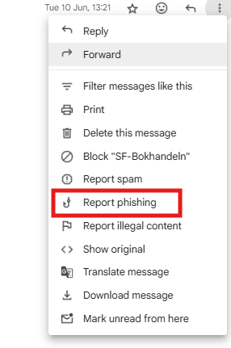

Lately, I've beeng getting phishing emails pretending to be bank transactions from the Philippines. This is not new, even in the United States or other parts of the world.

## What Is a Phishing Email and How to Spot One?

Imagine someone pretending to be your friend so they can steal your lunch money. Online, this kind of trick is called **phishing** but instead of lunch money, scammers are after your personal information like passwords, bank details or account logins.

A **phishing email** is a fake message designed to look like it’s from someone you trust like a bank, a popular website or even your school. The goal is to get you to click a link, download a file or share personal information.

## How Phishing Emails Work

1. **Imitation:** The email is made to look real. Scammers might use a company’s logo, copy the colors and even fake the "From" address.
2. **Urgency:** They’ll try to make you panic or act fast. Common tricks include messages like "_Your account will be deleted in 24 hours!_" or "_Suspicious login detected!_"
3. **Bait:** There’s usually a link to a fake website or an attachment that can install harmful software.
4. **Hook:** If you click the link or give information, the scammer can use it to steal your accounts or money.

## Signs an Email Might Be a Phishing Email

Here are some red flags to watch out for:

1. **Strange Email Address:** Even if the name looks right, check the actual email address. _support@bdo.com.ph_ might be real, but _bryan.velasquez@ug.edu.ec_ is suspicious.
2. **Weird Links:** Mouse over a link (**without clicking**) to see where it really goes. If the link looks suspicious or unrelated to the company, it’s likely a scam. Here, it’s _**loom.ly/somethingelse**_.
3. **Pressure to Act Fast:** Scammers want you to click before you think. Real companies rarely demand instant action in one email.
4. **Poor Spelling and Grammar:** Many phishing emails have odd sentences or spelling mistakes that a real company wouldn’t make.
5. **Too Good to Be True:** If an email says you’ve won a huge prize but you never entered a contest, don’t trust it!

## What to Do if You Suspect Phishing?

* Don’t click links or download files.
* Don’t reply to the email.
* Report it to your email provider or your school’s IT department.

* Delete it after reporting.

## The Bottom Line

Phishing emails are like digital traps. Designed to fool you into giving away your private information. If something feels off, trust your gut and double-check before clicking anything. Staying cautious online is just as important as locking your front door in real life.

## Your support means a lot — you can [buy me a coffee](https://coff.ee/hmenorjr) to help me continue creating
